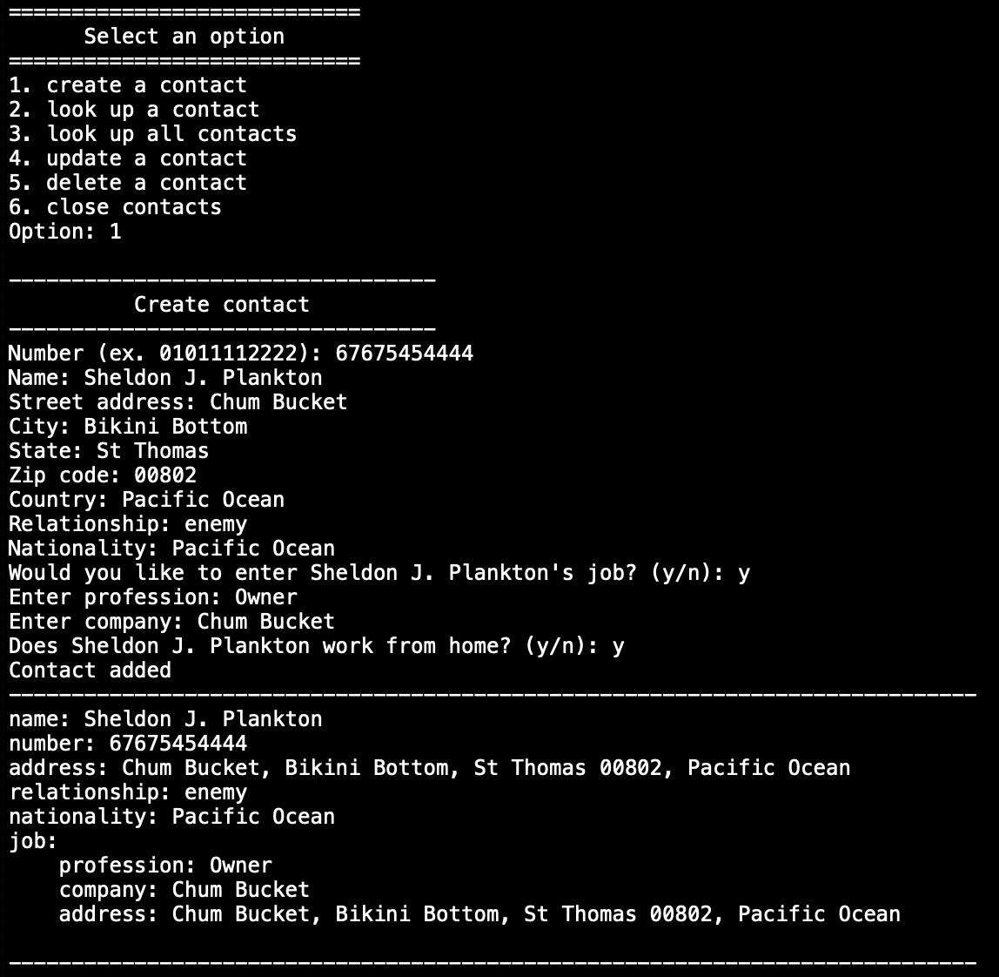

# BigData19-ContactProject 2
Does the same thing as [version 1](https://github.com/markk628/BigData19-ContactsProject), but this time using MySQL instead of using a locally saved hashmap in a bin file
A java program that creates/reads/updates/deletes contacts. Created contacts are saved in a MySQL database (scripts in project)
## Dependencies
Need a [MySQL Connector](https://downloads.mysql.com/archives/c-j/)
## Pictures
### Create a contact

### Read all contacts

### Read a contact

### Update a contact

### Delete a contact

